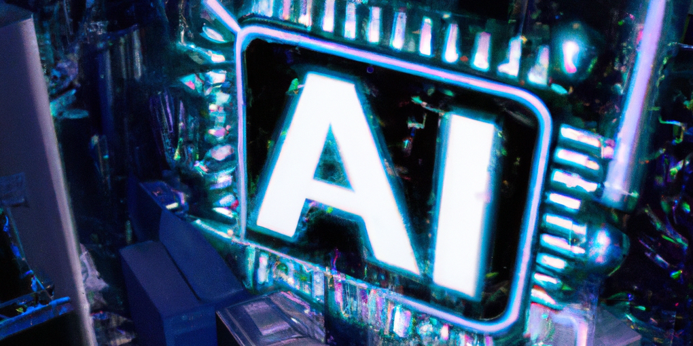

### 参考にしたページ

[画像生成AIのプロンプトはChatGPTに考えてもらうのがよさそう【DALL·E 2/Midjourney】](https://note.com/keitomatsuri/n/na4a07649c985)

### DALL-E

DALL-Eで画像を生成する場合、基本的には英語でプロンプトを用意する必要がある。  
自力で書いても良いのだが、今回はChatGPTに要望を伝えて、画像生成AI用のプロンプトを作ってもらった。

例えばAI関連記事用の画像はこんな感じ。

> A gleaming AI chip, with the letters 'AI' illuminated in neon, floating amidst the skyscrapers of futuristic Tokyo, where holographic displays and bustling drones paint the skyline.

出力されたものがこちら。

プロンプトの作成にコツが必要なのは相変わらずだが、ChatGPTにお願いすればある程度良い感じにしてくれるので、自分で書くよりは楽だと思う。
