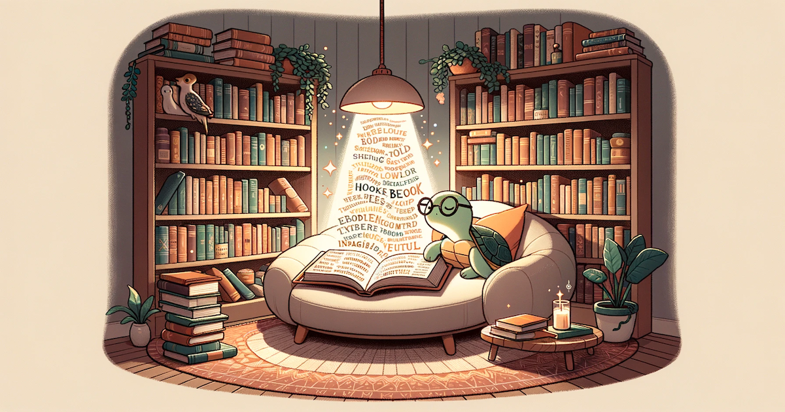
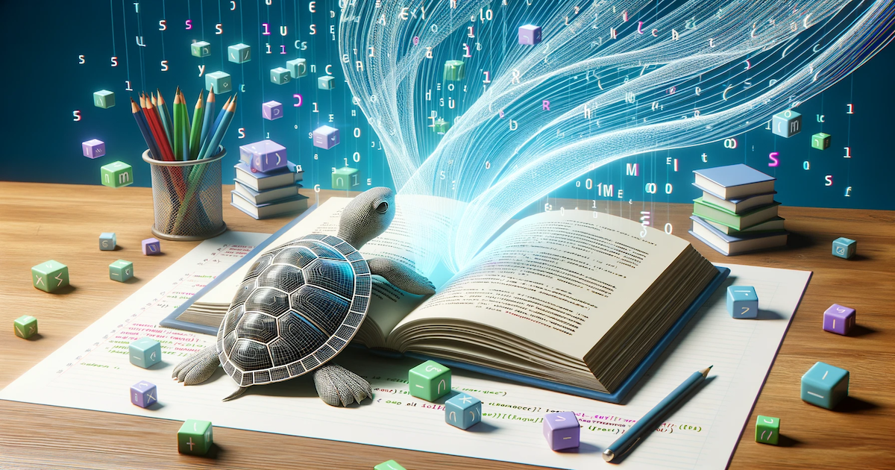

つい1ヶ月前に [ChatGPTでプロンプトを用意して、DALL-Eで画像を作ってみた](https://www.nagopy.com/blog/2023/09/10-chatgpt-ai-image-prompting/) という記事を書いた。  
しかし、その直後の2023/9/21に [DALL-E 3](https://openai.com/dall-e-3) がアナウンスされ、ついにChatGPT Plusで利用できるようになった。

- ブログのhero imageを作りたい
- xxカテゴリ
  - yyやzzの記事を書く予定
- イラスト風で
- 亀を入れて

などの情報を渡すだけで簡単に画像を作成できる。
（亀は、今後同じことをする人が増えることを見越して、まず被らないだろうということで入れてみた）

作成された画像はこちら。お手軽にハイクオリティだなぁ。

なお、作成した画像はOpenAIのポリシーに反していなければ商用利用も可能。

> As with DALL·E 2, the images you create with DALL·E 3 are yours to use and you don't need our permission to reprint, sell or merchandise them.
>