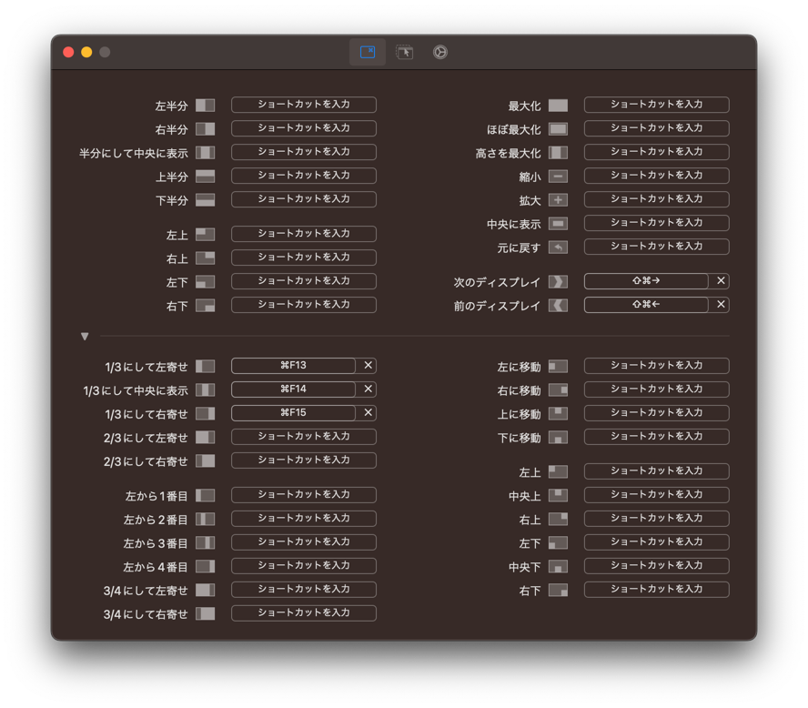

Macでウィンドウを縦に3分割する方法を書き残しておく。

## 候補になるアプリ

- [Magnet](https://magnet.crowdcafe.com/)
- [BetterSnapTool](https://folivora.ai/)
- [Spectacle](https://github.com/eczarny/spectacle)
- [Rectangle](https://github.com/rxhanson/Rectangle)

MagnetとBetterSnapToolは有料アプリ。既に購入済みの場合は他を選ぶ必要はない。

ググると無料アプリとしてSpectacleの名前があがるが、開発が終了しているため、今から使うのは不適切。  
後継のRectangleを使うのが良い。無料でも画面分割は期待通り機能する。

## Rectangle

### インストール

```bash
brew install --cask rectangle
```

### 設定



- 別アプリと競合すると面倒なので、使わないショートカットキーは無効にする
- 「1/3にして左寄せ」などのショートカットキーを設定する
  - ウィンドウが縦向きの場合、左寄せ・中央寄せ・右寄せは上寄せ・中央寄せ・下寄せになる


- 「ログイン時に起動」にチェックを入れる
- あとはお好みで

