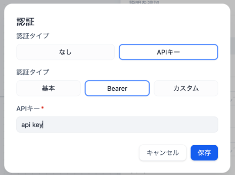
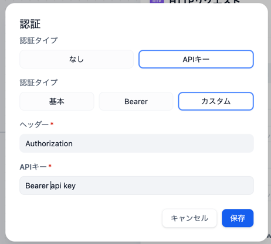

以下のキャプチャのように、HTTPリクエストのBearerトークンを設定していたところ、2024/7/5から `run failed: authorization config header is required` というエラーが出るようになった。

原因までは調べていないが、以下のように「カスタム」でヘッダーを設定することでエラーが解消した。

issueはこれかな。
https://github.com/langgenius/dify/issues/6033