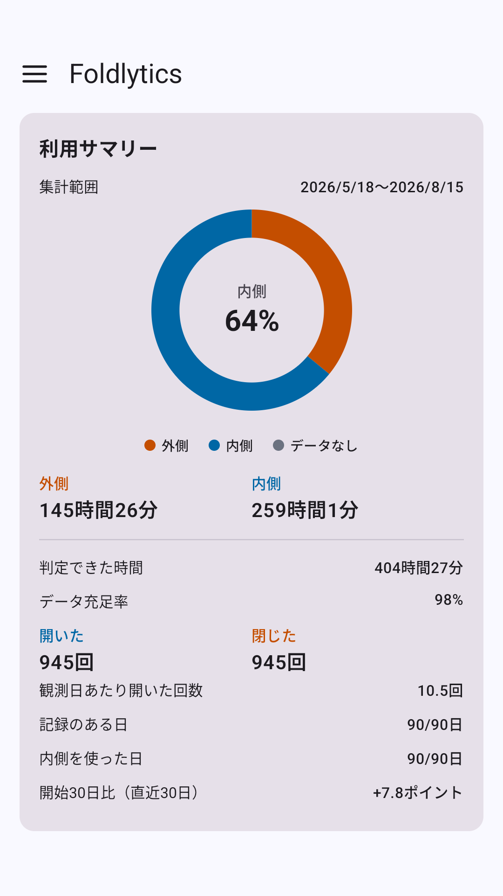
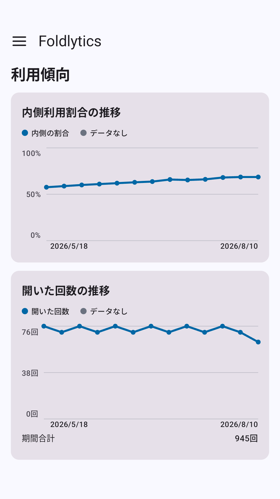
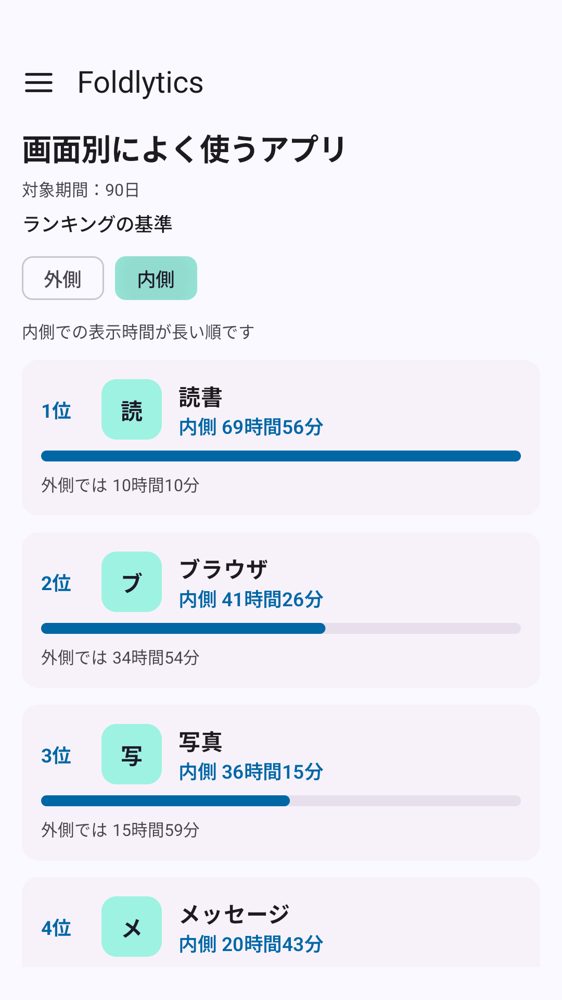

[FoldlyticsをGoogle Playで見る](https://play.google.com/store/apps/details?id=com.nagopy.android.foldlytics)

開かない折りたたみスマホは、ただ少し重たくて、かなり高い普通のスマホでしかない。

自分は毎年スマホを買い替えている。初代Pixel FoldとPixel 9 Pro Foldも、それぞれ数ヶ月から1年ほど使った。Pixel 9 Pro Foldでは、大きな画面で読書や動画を楽しんだ。このあたりは以前、[Pixel 9 Pro Foldを使ってみた感想](https://www.nagopy.com/blog/2024/09/23/pixel-9-pro-fold/)にも書いた。

ただ、外側のディスプレイが普通のスマホとして十分使いやすい分、わざわざ端末を開かなくても済むことが多い。振り返ると、「それほど開いて使っていなかったのでは」という感覚も残っている。

実際、重さに耐えかねて、折りたたみではなくiPhoneやPixel 10 Pro XLを使った年もある。それでも今年は、どうしてももう一度折りたたみスマホを使いたくなり、Pixel 11 Pro Foldを予約した。

今度は「あまり開かなかった気がする」という感覚だけで終わらせず、1年間の使い方を数字で残しておきたい。そのために作ったのが、FoldlyticsというAndroidアプリだ。

## Foldlyticsで記録できること

Foldlyticsは、対応する折りたたみAndroid端末で、外側と内側それぞれの利用時間、検出した開閉回数、よく使うアプリを記録する。

アプリ別の一覧では、外側と内側を切り替え、それぞれで長く表示していたアプリを確認できる。普段の連絡や検索は外側、Kindleや動画アプリは内側、といった使い分けが可視化できる。

確認できる項目は[GitHubの機能一覧](https://github.com/75py/foldlytics-android/blob/main/README-ja.md)にまとめた。アプリで答えたいことや設計方針については、[Foldlyticsを作った理由](https://github.com/75py/foldlytics-android/blob/main/docs/CONCEPT-ja.md)に詳しく書いている。

利用状況は端末内に保存し、外部へ自動送信しない。

## まずは1年間、記録してみる

Pixel 11 Pro Foldを使い始めたら、まずは30日、次に90日、そして1年という区切りでデータを見てみるつもりだ。

見たいのは、内側を使った日数や1日あたりの開いた回数、内側で長く使ったアプリだ。最初の30日と比べて内側の割合がどう変わるのか、重さや価格に見合うだけ使ったのか確かめたい。

内側をほとんど使っていなければ、次は通常のスマホを選ぶ。その判断を感覚ではなく自分の記録からできれば良いと思っている。

FoldlyticsをGoogle Playで公開した。折りたたみスマホを使っていて、「自分は実際どのくらい開いているのだろう」と思ったことがある人は、しばらく記録してみてほしい。

なお、リリース時点ではPixel 9 Pro Foldでしか動作確認していないため、不具合があれば連絡して欲しい。

[FoldlyticsをGoogle Playで見る](https://play.google.com/store/apps/details?id=com.nagopy.android.foldlytics)

ソースコードと詳しい仕様は[GitHub](https://github.com/75py/foldlytics-android)で公開している。

一緒に折りたたみスマホライフを満喫しよう。
